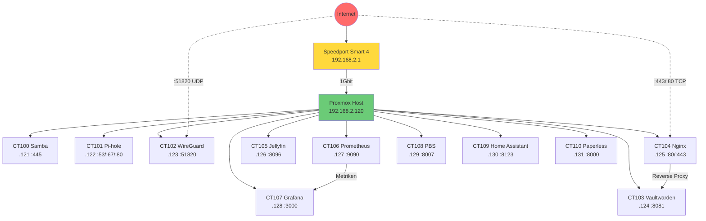

# Netzwerk-Diagramm

## Topologie

```
┌──────────────────────────────────────────────────────────────────────┐
│                    HEIMNETZWERK 192.168.2.0/24                       │
│                                                                      │
│   Internet                                                           │
│   ────┬─────                                                         │
│       │                                                              │
│       ▼                                                              │
│   [Speedport Smart 4]                                                │
│   192.168.2.1  │  DHCP: Deaktiviert (Pi-hole uebernimmt)            │
│                │                                                     │
│   ─────────────┴─────────────────────────────────────────────────    │
│                │                                                     │
│                │ (1 Gbit Ethernet)                                   │
│                │                                                     │
│   ┌────────────┴─────────────────────────────────────────────────┐   │
│   │  PROXMOX HOST (rxfsys) - 192.168.2.120                      │   │
│   │  https://192.168.2.120:8006                                  │   │
│   │                                                              │   │
│   │  nic0 ──► vmbr0 (Bridge)                                    │   │
│   │           │                                                  │   │
│   │  ┌────────┴──────────────────────────────────────────────┐   │   │
│   │  │                 LXC CONTAINER                         │   │   │
│   │  ├───────────────────────────────────────────────────────┤   │   │
│   │  │  CT 100 - Samba         192.168.2.121  :445           │   │   │
│   │  │  CT 101 - Pi-hole       192.168.2.122  :53/:80/:67   │   │   │
│   │  │  CT 102 - WireGuard     192.168.2.123  :51820/:51821 │   │   │
│   │  │  CT 103 - Vaultwarden   192.168.2.124  :8081         │   │   │
│   │  │  CT 104 - Nginx-Proxy   192.168.2.125  :80/:443/:81  │   │   │
│   │  │  CT 105 - Jellyfin      192.168.2.126  :8096         │   │   │
│   │  │  CT 106 - Prometheus    192.168.2.127  :9090         │   │   │
│   │  │  CT 107 - Grafana       192.168.2.128  :3000         │   │   │
│   │  │  CT 108 - PBS           192.168.2.129  :8007         │   │   │
│   │  │  CT 109 - Home Assist.  192.168.2.130  :8123         │   │   │
│   │  │  CT 110 - Paperless     192.168.2.131  :8000         │   │   │
│   │  └───────────────────────────────────────────────────────┘   │   │
│   └──────────────────────────────────────────────────────────────┘   │
│                                                                      │
│   IP-Bereiche:                                                       │
│   • Server (statisch): 192.168.2.120-131                             │
│   • Clients (DHCP):    192.168.2.30-119 (via Pi-hole)                │
│   • Reserviert:        192.168.2.2-29, 192.168.2.132-254             │
└──────────────────────────────────────────────────────────────────────┘
```

## Dienste-Verbindungen

```
                    EXTERN (Internet)
                         │
              ┌──────────┴──────────┐
              │                     │
         :51820 (UDP)          :443/:80 (TCP)
              │                     │
              ▼                     ▼
        [CT 102]              [CT 104]
        WireGuard             Nginx Proxy
              │                     │
              │              ┌──────┴──────┐
              │              │             │
              │              ▼             ▼
              │         [CT 103]      (weitere
              │         Vaultwarden    Dienste)
              │           :8081
              │
              ▼
        Zugriff auf alle
        LAN-Dienste via VPN


       INTERN (LAN)
    ┌───────────────────────────────────┐
    │                                   │
    │  [CT 101] Pi-hole ◄── alle DNS    │
    │    :53 / :67         Anfragen     │
    │                                   │
    │  [CT 100] Samba ◄── Dateifreigabe │
    │    :445                           │
    │                                   │
    │  [CT 105] Jellyfin ◄── Medien    │
    │    :8096                          │
    │                                   │
    │  [CT 106] Prometheus ──►          │
    │    :9090            [CT 107]      │
    │    (sammelt)        Grafana       │
    │                      :3000        │
    │                    (visualisiert) │
    │                                   │
    │  [CT 108] PBS ◄── Backups aller  │
    │    :8007          Container       │
    │                                   │
    │  [CT 109] Home Assistant          │
    │    :8123                          │
    │                                   │
    │  [CT 110] Paperless               │
    │    :8000                          │
    └───────────────────────────────────┘
```

## Mermaid-Diagramm

Fuer GitHub-Rendering (wird automatisch als Grafik dargestellt):


