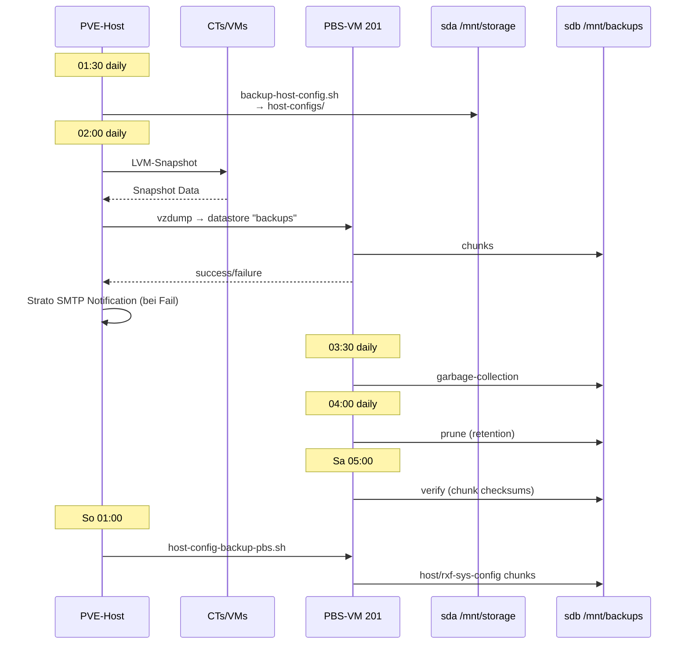

# Backup-Datenfluss

## Zeitlinie ein Tag

```
00:00 ┬──── Nacht ────────────────────────────────────────
      │
01:30 ●  host-config-backup.sh
      │  tar.zst → /mnt/storage/host-configs/
      │  ~5 MB pro Lauf, 30 d Retention
      │
02:00 ●  vzdump pbs-nightly
      │  alle Guests (außer VM 201) → PBS-Datastore
      │  ~3-15 min total, inkrementell
      │  Mail an info@rxf-sys.de bei Failure
      │
03:30 ●  PBS Garbage Collection (in VM 201)
      │  entfernt referenz-freie Chunks
      │  ~1 s (klein)
      │
04:00 ●  PBS Prune `daily-prune`
      │  applies retention: 7d / 4w / 6m
      │  entfernt überflüssige Snapshots
      │
05:00 ●  (Sa) PBS Verify
      │  Chunk-Checksum-Verify
      │  ~30 min
      │
01:00 ●  (So) host-config-backup-pbs.sh
      │  → PBS host/rxf-sys-config
      │
24:00 ┴────────────────────────────────────────────────────
```

## Backup-Pfade


