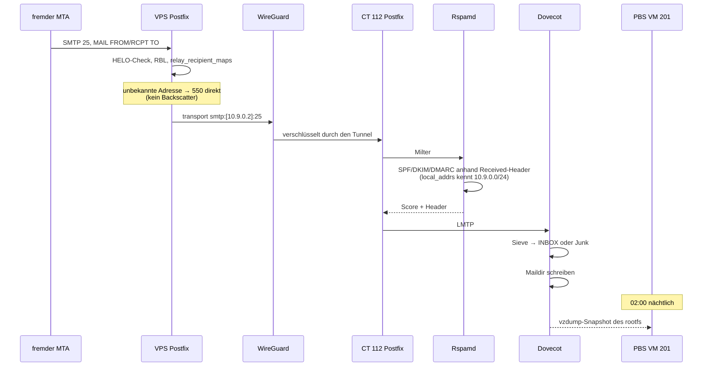
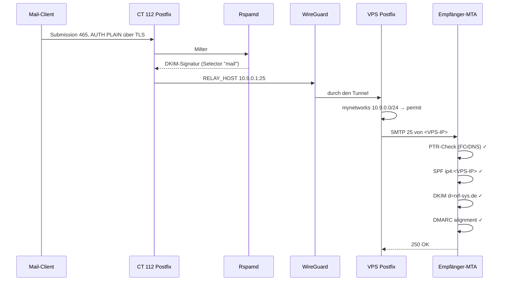

# Mail-Datenfluss (geplant)

> **Status: Planung.** Beschreibt die Zielarchitektur aus
> [../11-mailserver/](../11-mailserver/), nicht den Ist-Zustand. Aktuell läuft
> Mail für `rxf-sys.de` über Strato bzw. Cloudflare Email Routing.

## Warum ein VPS dazwischen steht

```
         ┌─────────────────────────────────────────────────────────┐
         │ Was NICHT geht                                          │
         │                                                          │
         │  Internet ──25──► Cloudflare Tunnel ──► CT 112           │
         │                   ✗ proxyt nur HTTP/HTTPS/WebSocket      │
         │                                                          │
         │  Internet ──25──► Router ──► CT 112                      │
         │                   ✗ kein Port-Forwarding (Grundsatz)     │
         │                   ✗ kein PTR auf Privatkunden-IP         │
         │                   ✗ IP in Spamhaus PBL gelistet          │
         └─────────────────────────────────────────────────────────┘
```

Details: [../11-mailserver/00-machbarkeit.md](../11-mailserver/00-machbarkeit.md)

## Zielarchitektur

```
   fremde MTAs                                          Mail-Clients
   (Gmail, GMX, …)                                      (Handy, Laptop)
        │                                                     │
        │ SMTP 25                                             │ 993 / 465
        ▼                                                     ▼
┌───────────────────────────────────────────────────────────────────────┐
│ VPS   mail.rxf-sys.de   statische IPv4/IPv6, PTR = mail.rxf-sys.de    │
│                                                                        │
│  Postfix (Relay, kein Storage)          nginx stream (TCP-Passthrough) │
│  ├─ IN : relay_domains = rxf-sys.de     ├─ 993 ──► 10.9.0.2:993        │
│  │       relay_recipient_maps (!)       └─ 465 ──► 10.9.0.2:465        │
│  │       RBL + HELO-Checks                 (TLS endet NICHT hier)      │
│  │       transport → smtp:[10.9.0.2]:25                                │
│  └─ OUT: mynetworks = 10.9.0.0/24  ──► Welt (mit sauberem PTR)        │
│                                                                        │
│  fail2ban · certbot (HTTP-01) · unbound · ufw                          │
└───────────────────────────────┬───────────────────────────────────────┘
                                │  WireGuard 10.9.0.0/24
                                │  aufgebaut von CT 112 nach außen
                                │  PersistentKeepalive = 25
╌╌╌╌╌╌╌╌╌╌╌╌╌╌╌╌╌╌╌╌╌╌╌╌╌╌╌╌╌╌╌┼╌╌╌╌╌╌╌ Router (kein Forwarding) ╌╌╌╌╌╌
                                │
   HEIMNETZ 192.168.2.0/24      ▼
┌───────────────────────────────────────────────────────────────────────┐
│ rxf-sys 192.168.2.200                                                  │
│                                                                        │
│  CT 112  mailserver  192.168.2.215  ·  wg0 10.9.0.2                   │
│  ┌──────────────────────────────────────────────────────────────┐     │
│  │ Postfix  25 (nur wg0) · 465/587 (LAN + wg0)                  │     │
│  │    │                                                          │     │
│  │    ▼                                                          │     │
│  │ Rspamd   Spam-Score · SPF/DKIM/DMARC-Prüfung                 │     │
│  │          local_addrs = 10.9.0.0/24  → echte Absender-IP      │     │
│  │          signiert ausgehend mit DKIM-Selector "mail"          │     │
│  │    │                                                          │     │
│  │    ▼                                                          │     │
│  │ Dovecot  993 IMAPS · 4190 ManageSieve · Sieve-Regeln         │     │
│  │    │                                                          │     │
│  │    ▼                                                          │     │
│  │ Maildir  /var/mail  auf rootfs local-lvm                     │     │
│  └──────────────────────────────────────────────────────────────┘     │
│         │                                                              │
│         │ vzdump 02:00                                                 │
│         ▼                                                              │
│  VM 201  pbs  ──► Datastore auf sdb                                   │
│                                                                        │
│  CT 110  cloudflared ──Tunnel──► webmail / autoconfig / mta-sts (HTTP) │
│  CT 103  uptime-kuma ──► Monitore auf 25/465/993 + Roundtrip           │
│  CT 102  vaultwarden ──► Postfach-Passwörter, DKIM-Key, Restic-PW      │
└───────────────────────────────────────────────────────────────────────┘
```

## Eingehende Mail



## Ausgehende Mail



## Die drei Stellen, an denen es bricht

| Stelle | Symptom | Erste Prüfung |
|--------|---------|---------------|
| WireGuard down | eingehende Mail stapelt sich auf dem VPS, ausgehende bleibt in CT 112 | `wg show` auf beiden Seiten, `latest handshake` |
| `relay_recipients` nicht gepflegt | „Relay access denied" für eine gerade angelegte Adresse | `postmap -q neu@rxf-sys.de hash:/etc/postfix/relay_recipients` |
| Zertifikat abgelaufen | mit MTA-STS `enforce`: **komplette Zustellung stoppt** | `openssl s_client -connect mail.rxf-sys.de:25 -starttls smtp` |

Alle drei sind in [../11-mailserver/06-betrieb.md](../11-mailserver/06-betrieb.md#monitoring)
mit Monitoren abgedeckt.
