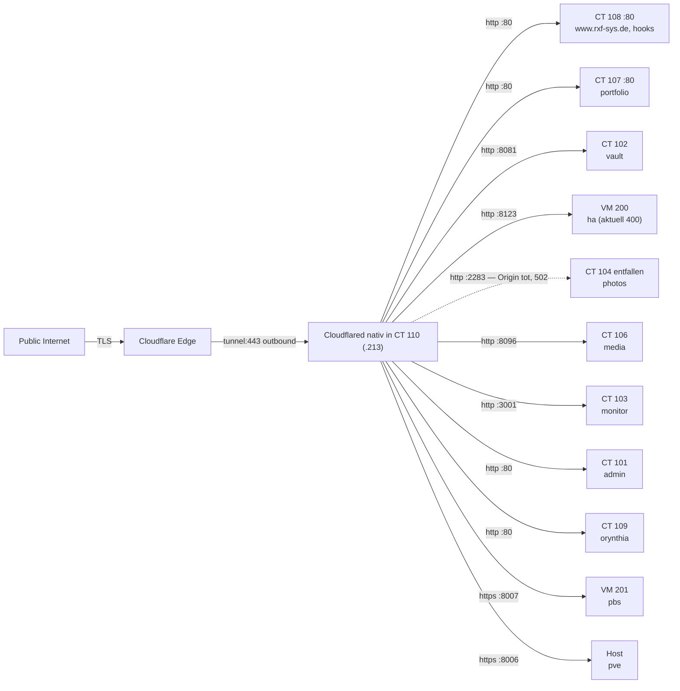

# Netzwerk-Diagramm

## Physisch + Logisch (ASCII)

```
                 ┌──────────────────┐
                 │  Internet (WAN)  │
                 └────────┬─────────┘
                          │
                  ┌───────┴───────┐
                  │  Router .1    │
                  │  (UniFi/      │
                  │   Speedport)  │
                  └───────┬───────┘
                          │ 192.168.2.0/24
            ┌─────────────┼─────────────┐
            │             │             │
        Client PCs    rxf-sys (.200)   ggf. weitere
        .30-.119      Proxmox VE 9.2   Geräte
                          │
                       nic0
                          │
                       vmbr0 (Bridge)
                          │
   ┌────────┬────────┬────────┬────────┬────────┬────────┬────────┐
   │        │        │        │        │        │        │        │
 CT 100   CT 101   CT 102   CT 103   CT 105   CT 106   CT 110   CT 111
 .201     .202     .203     .204     .206     .207     .213     .214
 nas      admin-   vault-   uptime-  magic-   jelly-   cloud-   rmm
 (Samba)  dash     warden   kuma     mirror   fin      flared   (RustDesk)
                                                         │
                    CT 107 .210  portfolio                │ nur outbound
                    CT 108 .211  welcome-page             │ (QUIC)
                    CT 109 .212  orynthia                 ▼
                    VM 200 .208  homeassistant   Cloudflare Edge
                    VM 201 .209  pbs                      ▲
                                                          │
                                                 Public Internet
                                                   (12 Hostnames)
```

## Cloudflare Tunnel Routing



Die gestrichelte Kante ist eine Altlast: `photos.rxf-sys.de` zeigt weiterhin auf
`192.168.2.205:2283`, wo mit CT 104 aber nichts mehr läuft. Siehe
[../03-netzwerk/cloudflare-tunnel.md](../03-netzwerk/cloudflare-tunnel.md).

## IP-Verteilung

```
192.168.2.0/24
│
├── .1                    Gateway / Router
├── .2-.29                Reserviert (Infrastructure)
├── .30-.119              DHCP (Clients)
├── .120-.199             Reserviert
├── .200                  rxf-sys HOST
├── .201                  CT 100 nas
├── .202                  CT 101 admin-dashboard
├── .203                  CT 102 vaultwarden
├── .204                  CT 103 uptime-kuma
├── .205                  (frei seit Auflösung CT 104 docker-host)
│                          ACHTUNG: photos.rxf-sys.de zeigt noch hierher
├── .206                  CT 105 magicmirror
├── .207                  CT 106 jellyfin
├── .208                  VM 200 homeassistant
├── .209                  VM 201 pbs
├── .210                  CT 107 portfolio
├── .211                  CT 108 welcome-page
├── .212                  CT 109 orynthia
├── .213                  CT 110 cloudflared
├── .214                  CT 111 rmm
└── .215-.254             Reserviert
```
