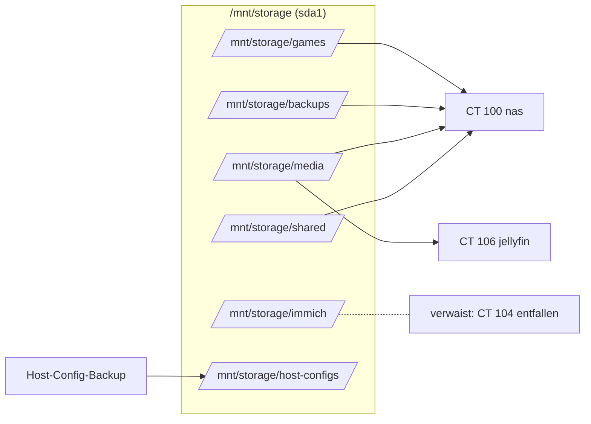

# Storage-Diagramm

## Physische Disks

```
┌────────────────────────────────────────────────────────────────────┐
│  PVE-Host rxf-sys                                                  │
│                                                                    │
│  ┌─────────────────┐  ┌────────────────┐  ┌────────────────────┐   │
│  │ nvme0n1   500 G │  │  sda     500 G │  │  sdb         480 G │   │
│  │ Kingston SA2000 │  │  Samsung 860EVO│  │  Lexar SSD         │   │
│  │                 │  │                │  │                    │   │
│  │ ┌─ pve-root 94G │  │ ┌── sda1 458G  │  │ ┌── sdb1 (PT)      │   │
│  │ ├─ pve-swap  8G │  │ │   ext4       │  │ │   (passthrough   │   │
│  │ └─ pve-data    │  │ │   /mnt/      │  │ │    an VM 201)    │   │
│  │    337G thinpool│  │ │   storage    │  │ │                  │   │
│  │      │          │  │ │              │  │ │                  │   │
│  │      ├ vm-100-* │  │ │ shared/      │  │ └── in VM 201:     │   │
│  │      ├ vm-101-* │  │ │ media/       │  │     /mnt/backups   │   │
│  │      ├ vm-102-* │  │ │ backups/     │  │     PBS-Datastore  │   │
│  │      ├ vm-103-* │  │ │ games/       │  │     "backups"      │   │
│  │      ├ vm-104-* │  │ │ immich/      │  │                    │   │
│  │      ├ vm-106-* │  │ │ host-configs/│  │     ~21 GB / 447 GB│   │
│  │      ├ vm-107-* │  │ │              │  │     Dedup-Ratio    │   │
│  │      ├ vm-108-* │  │ │              │  │     ~32×           │   │
│  │      ├ vm-109-* │  │ │              │  │                    │   │
│  │      ├ vm-200-* │  │ │              │  │                    │   │
│  │      └ vm-201-* │  │ │              │  │                    │   │
│  └─────────────────┘  └────────────────┘  └────────────────────┘   │
└────────────────────────────────────────────────────────────────────┘
```

## Bind-Mounts (Host → CTs)



## Storage-Flow Backup

```
┌──────────────┐  vzdump 02:00     ┌─────────────────────────┐
│  PVE-Host    │ ───────────────► │  PBS-VM 201 Datastore   │
│  + alle CTs/VMs│                  │  /mnt/backups (sdb1)    │
└──────────────┘                    │  47 % verfügbar 415 GB  │
        │                           └───────────┬─────────────┘
        │                                       │
        │ host-config-backup.sh 01:30           │ Garbage Collection 03:30
        ▼                                       │ Prune 04:00
┌──────────────────────────────┐                │ Verify So 05:00
│  /mnt/storage/host-configs/  │                │
│  (sda1, 30 d retention)      │                │
└──────────────────────────────┘                │
        │                                       │
        │ host-config-backup-pbs.sh So 01:00    │
        └───────────────────────────────────────┤
                                                ▼
                                       host/rxf-sys-config
```

## PBS-Datastore Inhalt (Stand 2026-08-05)

174 Snapshots gesamt, 31 GB von 460 GB belegt.

```
backups (in VM 201)
├── ct/
│   ├── 100/  (nas)             13 Snapshots
│   ├── 101/  (admin-dashboard) 13 Snapshots
│   ├── 102/  (vaultwarden)     13 Snapshots
│   ├── 103/  (uptime-kuma)     13 Snapshots
│   ├── 105/  (magicmirror)     13 Snapshots
│   ├── 106/  (jellyfin)        13 Snapshots
│   ├── 107/  (portfolio)       13 Snapshots
│   ├── 108/  (welcome-page)    13 Snapshots
│   ├── 109/  (orynthia)        13 Snapshots
│   ├── 110/  (cloudflared)     11 Snapshots
│   └── 111/  (rmm)             10 Snapshots
├── vm/
│   ├── 200/  (homeassistant)   13 Snapshots
│   └── 201/  (pbs)              9 Snapshots — letzter vom 21.05.2026,
│                                 seither per `exclude 201` ausgenommen
└── host/
    └── rxf-sys-config/          wöchentliche Snapshots
```

CT 104 ist mit der Auflösung des Containers aus dem Datastore verschwunden;
die alten Snapshots sind über die Prune-Policy ausgelaufen.

Retention (Prune-Policy `daily-prune`):
- keep-daily: 7
- keep-weekly: 4
- keep-monthly: 6
